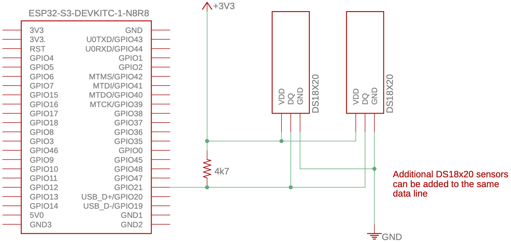
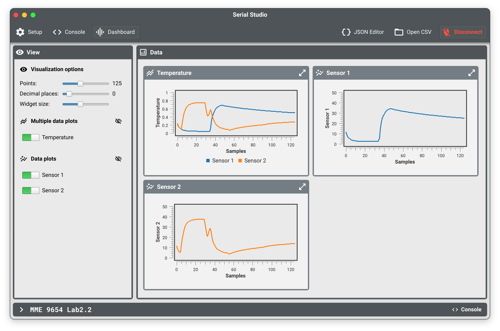

| Supported Targets | ESP32 | ESP32-C3 | ESP32-S2 | ESP32-S3 |
| ----------------- | ----- | -------- | -------- | -------- |
# Lab 2-Part 2

This lab is based on the DS18x20 example from the 3rd party esp-idf-lib developed and maintained by Ruslan Uss (https://github.com/UncleRus/esp-idf-lib)

The example configures one or `CONFIG_EXAMPLE_DS18X20_MAX_SENSORS` of `ds18x20` devices (the default is 8) with an internal pullup on
`CONFIG_EXAMPLE_ONEWIRE_GPIO` (see below for defaults).  Use `idf.py menuconfig` > `Example configuration` to change the default values.

The program reads sensor values from the sensors and the address of each sensors, and shows them in a loop. The internal (~47 kΩ) pull-ups of the ESP32 do appear to work, at least for simple setups (one or two sensors connected with short leads), but do not technically meet the pull-up requirements indicated on the [DS18B20 datasheet](https://www.analog.com/media/en/technical-documentation/data-sheets/ds18b20.pdf) and may not always be reliable. For this reason, an external 4.7 kΩ resistor is recommended.

The [DS18B20](https://www.analog.com/media/en/technical-documentation/data-sheets/ds18b20.pdf) supplied in the MME 9654 Lab kit is a pre-wired and waterproof version of a 1 Wire DS18B20 sensor. The sensor is encapsulated by a 30 mm long, 6 mm diameter stainless steel tube. The technical specifications are:

* Usable temperature range: -55 to 125°C (-67°F to +257°F)
* ±0.5°C Accuracy from -10°C to +85°C
* Query time is less than 750 ms
* 9 to 12 bit selectable resolution from on-board ADC
* Uses the Dallas/Maxim 1-Wire interface, requiring only one digital pin for communication
* Multiple sensors can share a single data line
* Unique 64 bit ID burned into chip
* Usable with 3.0V to 5.5V power/data and can operate in a parasitic power mode that gets power from the data line
* Cable is 91 cm (36") long and 4 mm in diameter

It is useful for measuring in wet conditions or at a distance from the ESP32. Note that, while the sensor is rated for temperatures up to 125°C, the cable is jacketed in PVC, so it is best to keep it under 100°C. Because the sensor is digital, there is no signal degradation even over long distances. The only downside is that they use the Dallas 1-Wire protocol, which is somewhat complex, and requires a quite a bit of code to parse out the communication. Fortunately, there are libraries available to simplify the use of the sensors.

## How to Use Example

Before project configuration and build, be sure to set the correct chip target using `idf.py set-target esp32-s3`.

### Hardware Required

* An ESP32-S3-DevKitC-1 development board
* A USB cable for microcontroller power supply and programming
* Two waterproof DS18B20 1-wire digital temperature sensors
* One 4.7 kΩ 1/4 W resistor
* A solderless breadboard
* Jumper or Dupont wires (M/M, M/F) to connect components

Additional hardware used for lab exercise:

* WS2812 LED strip
* 5 kΩ potentiometer

Schematic:


Connect `DQ` pin to `CONFIG_EXAMPLE_ONEWIRE_GPIO`.

| Name | Description | Defaults |
|------|-------------|----------|
| `CONFIG_EXAMPLE_ONEWIRE_GPIO` | GPIO Number of 1-Wire bus, or `DQ` | "18" for `esp32c3`, "19" for `esp32` and `esp32s2`, and "21" `esp32s3` |

### Build and Flash

Run `idf.py -p PORT flash monitor` to build, flash and monitor the project.

(To exit the serial monitor, type ``Ctrl-]``.)

See the [Getting Started Guide](https://docs.espressif.com/projects/esp-idf/en/latest/get-started/index.html) for full steps to configure and use ESP-IDF to build projects.

Alternatively, this project can be developed using [VSCode](https://code.visualstudio.com) with the [PlatformIO IDE](https://platformio.org/platformio-ide) extension and the [Espressif 32 platform](https://registry.platformio.org/platforms/platformio/espressif32) installed.

## Example Output

```
I (278) app_start: Starting scheduler on CPU0
I (282) app_start: Starting scheduler on CPU1
I (282) main_task: Started on CPU0
I (292) main_task: Calling app_main()
I (322) ds18x20_test: 2 sensors detected
I (322) ds18x20_test: Measuring...
I (322) main_task: Returned from app_main()
I (1092) ds18x20_test: Sensor 590821c00b306028 (DS18B20) reports 20.438°C (68.787°F)
I (1092) ds18x20_test: Sensor fe0821c0190c3e28 (DS18B20) reports 5.062°C (41.112°F)
I (1842) ds18x20_test: Measuring...
I (2612) ds18x20_test: Sensor 590821c00b306028 (DS18B20) reports 20.438°C (68.787°F)
I (2612) ds18x20_test: Sensor fe0821c0190c3e28 (DS18B20) reports 5.000°C (41.000°F)
I (3362) ds18x20_test: Measuring...
I (4132) ds18x20_test: Sensor 590821c00b306028 (DS18B20) reports 20.438°C (68.787°F)
I (4132) ds18x20_test: Sensor fe0821c0190c3e28 (DS18B20) reports 5.000°C (41.000°F)
```

## Exercise

Load the example code and confirm that the temperature sensors are working properly. Check that the temperature from each device rises and falls as expected. Also confirm that the number of sensors is correctly detected when they are added and removed. Once the example is working properly, modify the example code to add the following functionality:

1. Output the measure temperature(s) to Serial Studio and create appropriate widget(s) to plot the temperature(s) over time.


2. Add the LED strip used for Part 1 and use it to display the temperatures of the two DS18B20 sensors. Use a different colour for each sensor and use a third colour when the two sensors are at the same temperature. Note that, unlike Part 1, the LEDs will be relatively static, only changing as the temperature rises and falls.

3. Add a potentiometer to adjust the range of temperatures that can be displayed from a narrow range of a few degrees to tens of degrees. You can choose to implment the adjustable display range in one of two ways: A) Define a fixed lower temperature and have the pot adjust the upper temperature that can be displayed, e.g., 0–10 °C, 0–45°C, 0–73°C, etc. B) Define a fixed middle temperature and have the pot adjust the temperatures above and below that can be displayed, e.g., 20±5 °C, 20±18 °C, 20±30 °C, etc. if the middle temperature is set to be 20 °C. Either is fine. In either implemenation, the temperature will not be displayed if it is out of range.

For these exercises, you can use your hands to warm the sensors from room temperature; however, you will likely need to use cold and/or hot water to obtain temperatures outside of the range of ambient to body temperature and allow for relatively quick temperature changes.

### Other Things to Explore
1. Add a warning flash that occurs when one or more sensors becomes disconnected.
2. Add a second potentiometer to give better control over the display range. One potentiometer sets the low temperature, and the second sets the high temperature.
3. Borrow additional DS18B20 sensors from a colleague and generalize your code to gracefully handle more temperature sensors.
